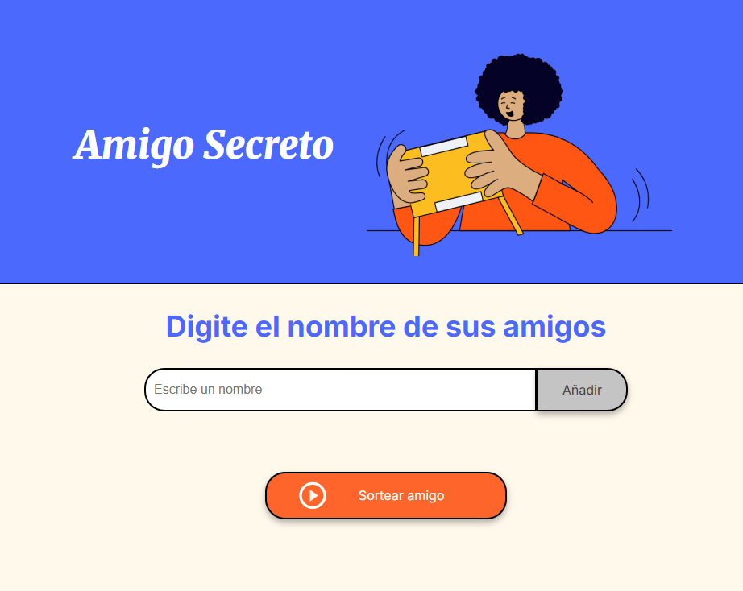

# Challenge Amigo Secreto

## Descripción
Este proyecto consiste en una aplicación web que permite organizar sorteos de "Amigo Secreto" de manera simple y aleatoria. La aplicación permite a los usuarios ingresar nombres de participantes y realizar un sorteo para seleccionar un amigo secreto al azar.

## Funcionalidades
- Añadir nombres de participantes a través de un formulario
- Validación de entradas para evitar campos vacíos
- Visualización de la lista de participantes añadidos
- Sorteo aleatorio para seleccionar un amigo secreto
- Visualización del resultado del sorteo

## Tecnologías utilizadas
- HTML5
- CSS3
- JavaScript 

## Autor
[Irwin Crisóstomo Porras]